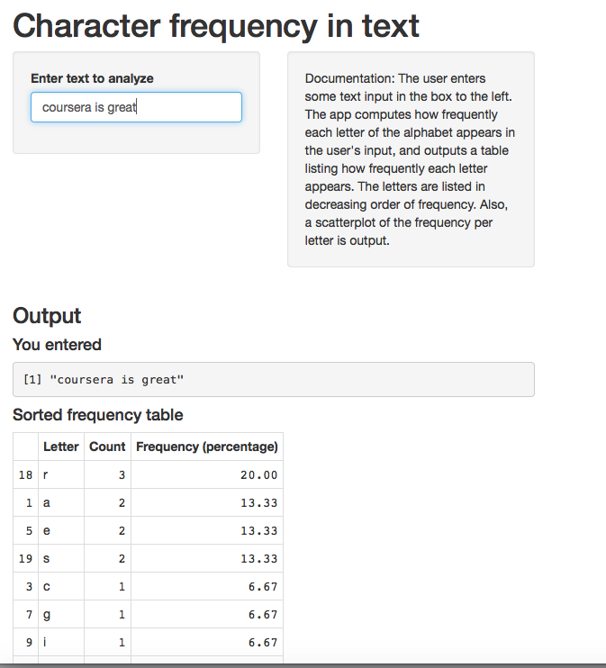

An app for calculating character frequency in text
========================================================
author: Yogesh
date: Fri Aug 19 22:14:19 2016
autosize: true

What does the app do?
===
The app asks the user for some text input, and computes how frequently each letter of the alphabet appears, 
and outputs a table listing how frequently each letter appears. The letters are listed in decreasing order of frequency. 
Also, a scatterplot of the frequency per letter is output.

No distinction is made between upper and lower case letters, and numbers and punctuation are ignored.

Where to find the app
========================================================

The app may be accessed at
<https://ykm2234.shinyapps.io/character-frequency/>

The ui.R and server.R files may be found at 
<https://github.com/ykm2234/data-products>

Screen shot
========================================================



Slide With Code
========================================================


```r
ordered_table("The quick brown fox jumps over the lazy dog")
```

```
   Letter Count Frequency (percentage)
15      o     4              11.428571
5       e     3               8.571429
8       h     2               5.714286
18      r     2               5.714286
20      t     2               5.714286
21      u     2               5.714286
1       a     1               2.857143
2       b     1               2.857143
3       c     1               2.857143
4       d     1               2.857143
6       f     1               2.857143
7       g     1               2.857143
9       i     1               2.857143
10      j     1               2.857143
11      k     1               2.857143
12      l     1               2.857143
13      m     1               2.857143
14      n     1               2.857143
16      p     1               2.857143
17      q     1               2.857143
19      s     1               2.857143
22      v     1               2.857143
23      w     1               2.857143
24      x     1               2.857143
25      y     1               2.857143
26      z     1               2.857143
```
